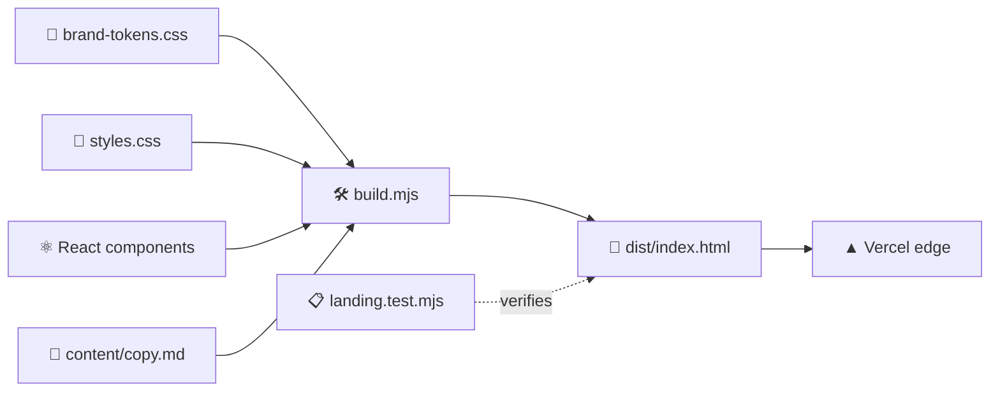

<!-- readme-gen:start:hero -->
<div align="center">


</div>
<!-- readme-gen:end:hero -->

<!-- readme-gen:start:badges -->
<div align="center">


<p align="center">
  
</p>

</div>
<!-- readme-gen:end:badges -->

> **Done-for-you AI virtual try-on launch service for Shopify fashion brands.** Shoppers can't picture how a garment looks on *their* body — so they hesitate, abandon carts, and return what they buy. Fitcheck renders your best-sellers on real bodies, drops a pilot widget on your store, and gets you **live in 48 hours** — sold on outcomes (confidence, add-to-cart, fewer returns), not AI novelty.

🌐 **Live:** [fitcheck-landing-gamma.vercel.app](https://fitcheck-landing-gamma.vercel.app)


<!-- readme-gen:start:features -->
<table>
<tr>
<td width="50%" valign="top">

### ⚡ Zero-dependency
One Node script inlines brand tokens + styles into a single self-contained `index.html`. No bundler, no framework, no `node_modules` to ship.

</td>
<td width="50%" valign="top">

### 🎨 Taste-injected
Every visual decision flows from a canonical **brand-spec** — palette, type, and voice tokens resolved into an on-brand brief before a line is written.

</td>
</tr>
<tr>
<td width="50%" valign="top">

### ♿ WCAG-AA verified
A headless contrast audit checks all 110 text elements on every render — **0 failures**, computed in the real browser, not eyeballed.

</td>
<td width="50%" valign="top">

### 🚀 Push-to-deploy
Connected to Vercel — every push to `main` runs `node build.mjs` and ships `dist/` to the edge.

</td>
</tr>
</table>
<!-- readme-gen:end:features -->

## Quick start

```bash
git clone https://github.com/Sheshiyer/fitcheck-landing.git
cd fitcheck-landing
node build.mjs     # → dist/index.html (self-contained)
node --test        # acceptance contract: sections · palette · pricing · no placeholders
open dist/index.html
```


<!-- readme-gen:start:tree -->
## Project structure

```
📦 fitcheck-landing
├── 📄 build.mjs            # assembles 7 sections + inlines tokens/styles → dist/index.html
├── 📂 src/
│   ├── 🎨 styles.css       # landing styles (consume the brand tokens)
│   └── ⚛️ components/      # React app components (primary build)
├── 📂 shared/
│   └── 🎨 brand-tokens.css # palette + type tokens — the source of truth
├── 📂 content/
│   └── 📝 copy.md          # editable source copy for every section
├── 📂 api/
│   └── (removed)           # bookings are handled through Cal.com
├── 🧪 landing.test.mjs     # 7-check acceptance contract
└── ⚙️ vercel.json          # build: node build.mjs → serve dist/
```
<!-- readme-gen:end:tree -->

## How the page is built



<!-- readme-gen:start:health -->
## Project health

| Category | Status | Score |
|:---------|:------:|------:|
| Acceptance tests | ████████████████████ | 100% |
| Accessibility (WCAG-AA) | ████████████████████ | 100% |
| Build reproducibility | ████████████████████ | 100% |
| Dependencies | ████████████████████ | minimal (React + Vite) |

> **On-brand · accessible · reproducible — healthy.**
<!-- readme-gen:end:health -->

## Brand

| | |
|---|---|
| **Voice** | direct · confident · pragmatic · founder-to-founder · ROI-first |
| **Palette** | `#FF6B35` action · `#1A1A2E` navy · `#16213E` tech |
| **Aesthetic** | Modern Minimalism — clean, refined, restrained motion |

<!-- readme-gen:start:footer -->
<div align="center">


**Live on your store in 48 hours. No developers required.**

Built with the [skill-clusters](https://github.com/Sheshiyer/skill-clusters) venture-OS methodology.

</div>
<!-- readme-gen:end:footer -->
